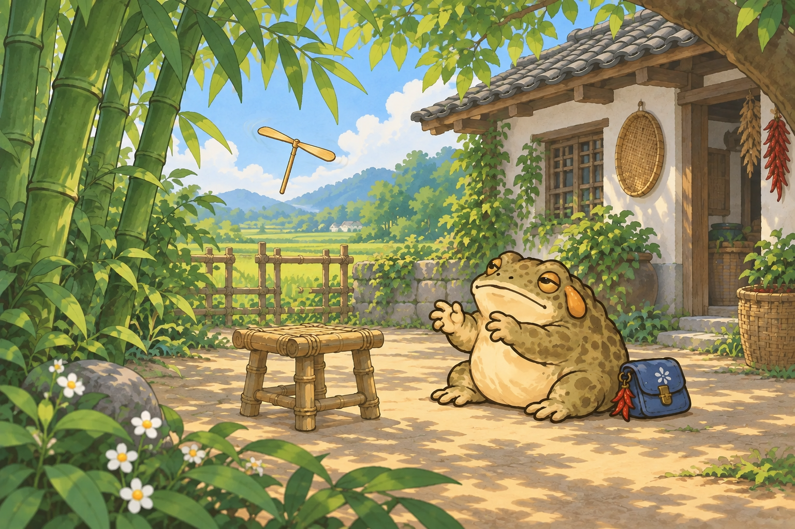
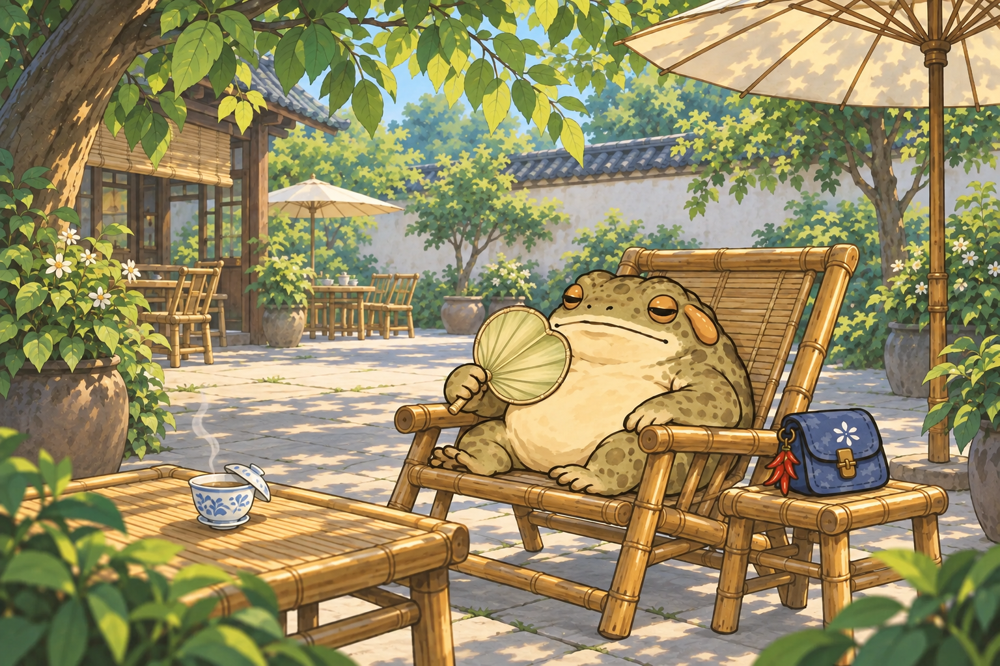

# 四地第四张见闻 · 看图

2026-09-15｜四张推荐候选，原生 1536×1024。沿用既有角色和手绘风格；河街展示减纹理修订版。尚未接入游戏或上线。

## 道明竹乡 · 竹蜻蜓，飞一小截

两只爪爪轻轻一搓，竹蜻蜓晃悠悠飞了起来。才飞过竹凳，它就仰起脑壳看了半晌：再来一回嘛。

## 成都坝坝茶 · 蒲扇摇来一阵风

茶还烫，它先摇起了蒲扇。风拐了个弯，先凉快的是肚皮，茶碗倒也不着急。

## 黄龙溪河街 · 送片叶子顺水走

它把一片落叶轻轻搁在水面上。叶子转了个圈才往前走，它蹲在岸边，又送了好一截目光。

## 田坝地头 · 给鸭儿让个路

田埂上来了一小队鸭儿，它把爪爪往旁边收了收。等最后那只慢慢跟上，它才背好包，继续往前晃。

[素材方案与检查](素材方案.MD) · [完整生成提示词](生成记录.json) · [河街修订提示词](河街减纹理修订.json)
