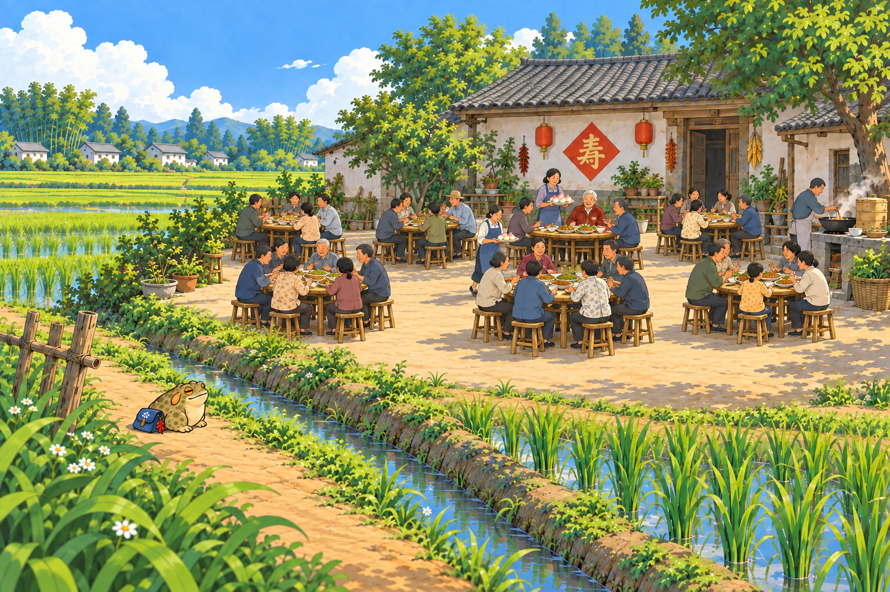

# 两张修订 · 小体型旁观者

2026-09-15｜内置模型重画。采耳改为看别人采耳；田坝选祝寿坝坝宴，疙宝站远、桌数增加。仅素材候选，未接入或上线。

## 成都坝坝茶 · 看人采耳，自己也眯了眼

师傅拿着细家伙什，在茶客耳边轻轻忙活。它隔着竹椅看了半晌，见人家眯着眼，自己也跟着眯了眯。

## 田坝地头 · 隔着田埂，看场寿宴

院坝里摆开了一桌又一桌，寿桃端到了老人家面前。它远远停在田埂边，看大家笑着敬寿：今天这儿，闹热得很。

其余两张保持不变：[道明竹乡 · 抓天牛](../cards-fourth-v2/card_daoming_04.png)、[黄龙溪河街 · 送落叶](../cards-fourth-v1/card_river_04-v2.png)。

[方案与检查](素材方案.MD) · [两张实际重画提示词](生成记录.json) · [寿宴增桌修订提示词](寿宴增桌修订.json)
