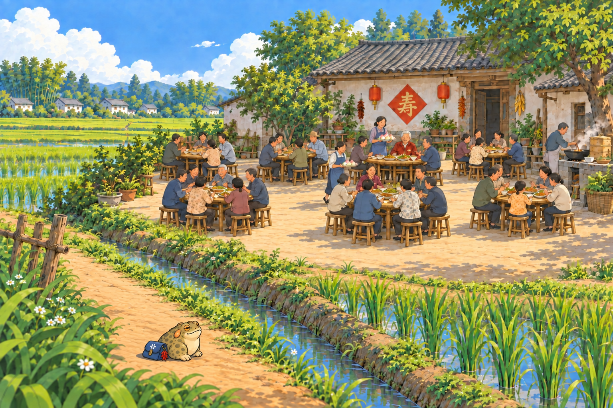

# 采耳与坝坝宴 · 前景修订

疙宝以比 v3 放大约 30% 为目标，连同布包前移到开阔前景；手绘重绘为近似比例。仅候选图，尚未接入游戏或发布 Mini。

## 成都坝坝茶：看人采耳，自己也眯了眼

师傅拿着细家伙什，在茶客耳边轻轻忙活。它隔着竹椅看了半晌，见人家眯着眼，自己也跟着眯了眯。

## 田坝地头：隔着田埂，看场寿宴

院坝里摆开了一桌又一桌，寿桃端到了老人家面前。它远远停在田埂边，看大家笑着敬寿：今天这儿，闹热得很。

道明竹乡[抓天牛](../cards-fourth-v2/card_daoming_04.png)与河街[送落叶](../cards-fourth-v1/card_river_04-v2.png)保持原样。[完整方案](素材方案.MD) · [内置模型实际提示词](生成记录.json)
