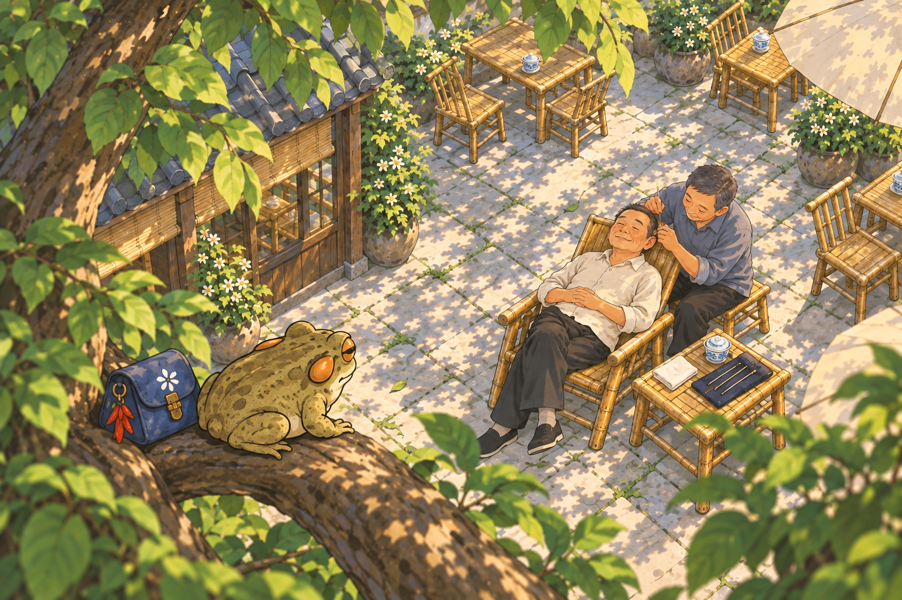
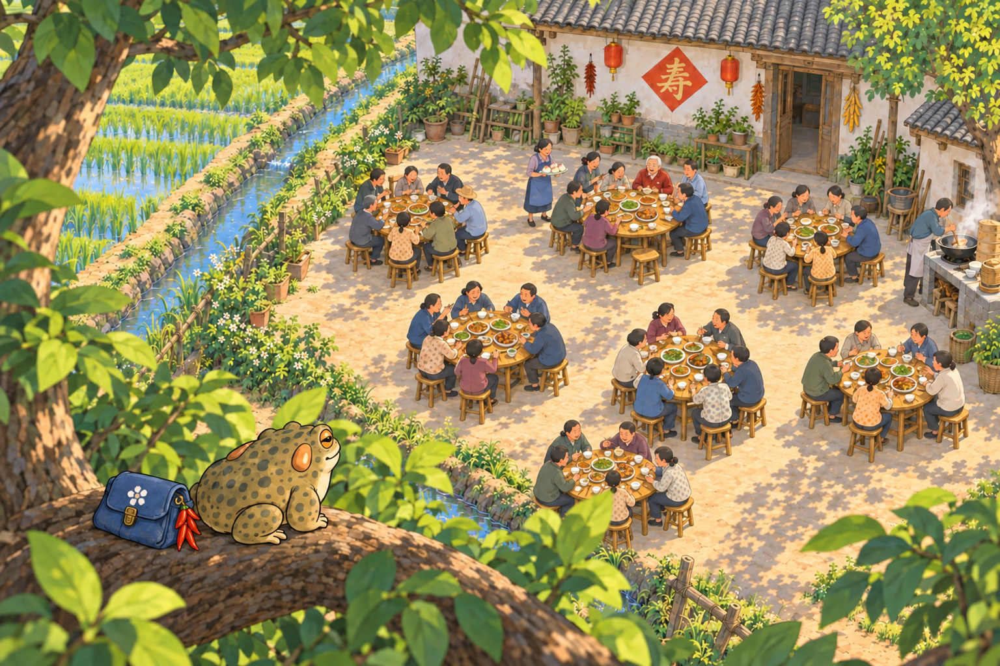

# 采耳与坝坝宴 · 树上俯视效果版

2026-09-15｜疙宝与布包在近处树枝上，镜头从其身后斜俯看下方活动。仅试构图、待用户选择；不接入游戏或发布 Mini。内置模型编辑，旧 v4 完整保留。

## 成都坝坝茶 · 树上看人采耳

[上一版地面视角](../cards-fourth-v4/card_tea_04.png)

## 田坝地头 · 树上看七桌祝寿宴

[上一版田埂视角](../cards-fourth-v4/card_tianba_04.png)

本轮只看图，不定稿故事文案；若采用树上版，原田坝故事的「停在田埂边」等用语需相应修订。

[方案与检查](素材方案.MD) · [实际提示词](生成记录.json) · [验收与哈希](验收记录.json)
