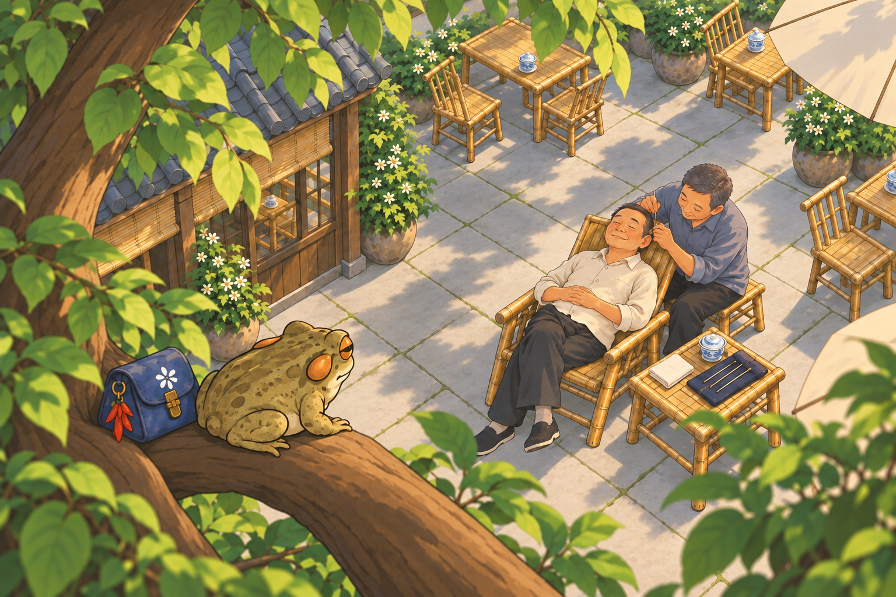
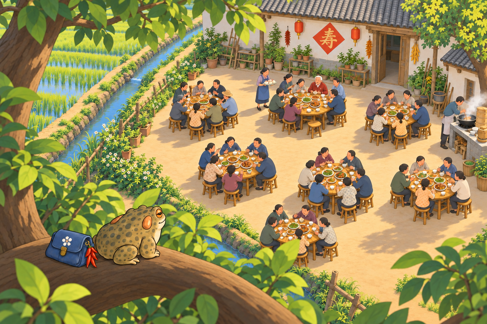

# 树上采耳 / 寿宴 · 减碎斑版 v6

2026-09-15｜按用户五张局部截图，内置模型重画材质与投影：收掉密集碎叶影、树皮碎块和地面杂色，保留俯视构图、角色和故事。不是模糊滤镜；仅候选图，未上线。

## 采耳：新版

[打开上一版对照](../cards-fourth-v5/card_tea_04.png)。保留石板接缝与苔线，杂乱小叶影合并为更大的连贯树荫。

## 寿宴：新版

[打开上一版对照](../cards-fourth-v5/card_tianba_04.png)。土色院坝更完整，树皮不再密集碎块化，仍可辨七桌与祝寿主题。

[方案与检查](素材方案.MD) · [实际提示词](生成记录.json) · [用户问题截图说明](反馈截图/说明.MD)
