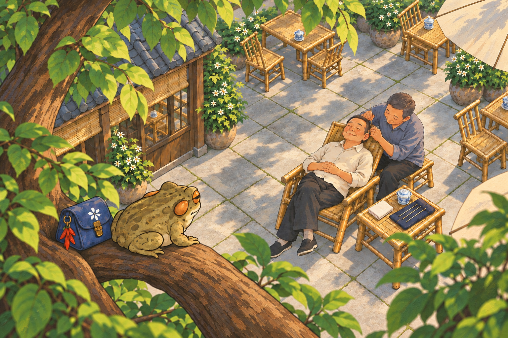
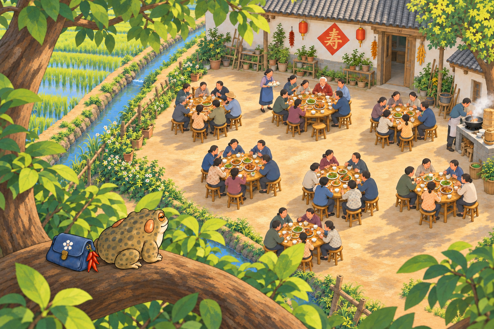

# 树上采耳 / 寿宴 · 纹理回补 v7

2026-09-15｜以 v6 为底，以增加约 30% 纹理为视觉目标，用内置模型补回适量树皮断纹、石板和土面的干笔触。大块树荫、树上构图与故事保留；不是恢复全部旧碎斑，也没有叠加程序噪点。比例为视觉目标，不是精确像素测量。

## 采耳 · 回补版

[v6 较净版本](../cards-fourth-v6/card_tea_04.png) · [v5 原碎斑版本](../cards-fourth-v5/card_tea_04.png)

## 七桌寿宴 · 回补版

[v6 较净版本](../cards-fourth-v6/card_tianba_04.png) · [v5 原碎斑版本](../cards-fourth-v5/card_tianba_04.png)

[实际提示词](生成记录.json) · [方案与检查](素材方案.MD) · [验收与哈希](验收记录.json)。仅候选，未接入或发布 Mini。
